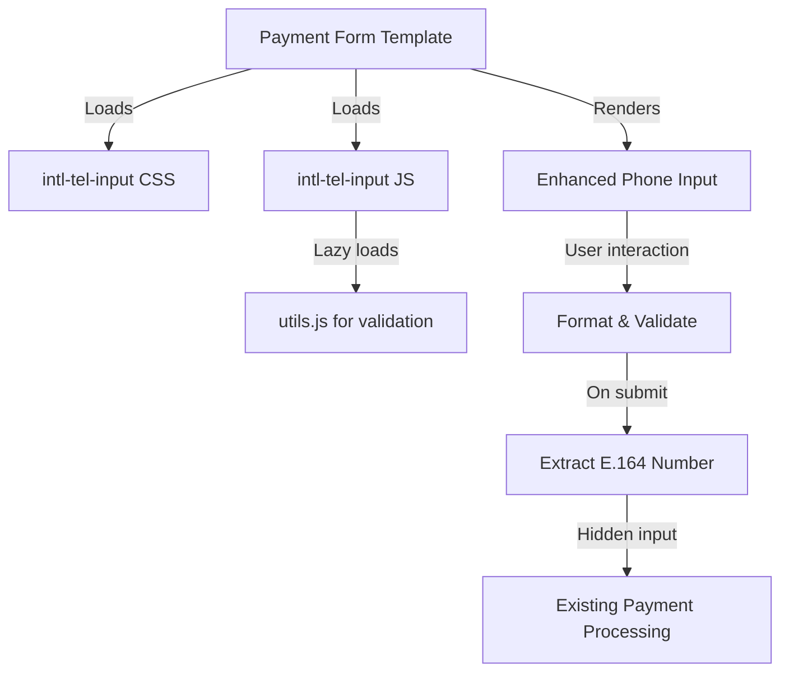

# Design Document

## Overview

This design enhances the payment portal's phone number input by integrating the intl-tel-input JavaScript library (v24.7.0+). The library will be loaded via CDN to avoid adding build dependencies, and will be configured to default to Senegal while supporting all international phone formats. The implementation focuses on maintaining backward compatibility with the existing payment processing logic while significantly improving the user experience for phone number entry.

The integration will be entirely client-side, requiring only modifications to the payment form template. The form submission will continue to work with the existing backend by extracting the full international number in E.164 format before submission.

## Architecture

### High-Level Architecture



### Integration Points

1. **Template Layer**: Modify `src/templates/payment.template.ts`
   - Add CDN links for intl-tel-input CSS and JS
   - Update phone input HTML structure
   - Add initialization script
   - Add custom CSS for styling integration

2. **Form Submission**: Client-side JavaScript
   - Intercept form submission
   - Extract full international number using `getNumber()`
   - Populate hidden input field
   - Validate before allowing submission

3. **Backend**: No changes required
   - Continues to receive phone number in same format
   - Existing validation and processing logic unchanged

## Components and Interfaces

### 1. CDN Resources

**CSS Resource**:
```html
<link rel="stylesheet" href="https://cdn.jsdelivr.net/npm/intl-tel-input@24.7.0/build/css/intlTelInput.css">
```

**JavaScript Resources**:
```html
<script src="https://cdn.jsdelivr.net/npm/intl-tel-input@24.7.0/build/js/intlTelInput.min.js"></script>
```

**Note**: The utils.js script will be lazy-loaded automatically by the library when needed for validation.

### 2. HTML Structure Changes

**Current Structure**:
```html
<input 
  type="tel" 
  id="phoneNumber" 
  name="phoneNumber" 
  value="${phoneNumber || ''}"
  placeholder="+221771234567"
  pattern="\\+?[0-9]{10,15}"
  required>
```

**New Structure**:
```html
<input 
  type="tel" 
  id="phoneNumber" 
  name="phoneNumber_display"
  value="${phoneNumber || ''}"
  required>
<input 
  type="hidden" 
  id="phoneNumberFull" 
  name="phoneNumber">
```

**Rationale**:
- The visible input (`phoneNumber_display`) is for user interaction with intl-tel-input
- The hidden input (`phoneNumber`) contains the E.164 formatted number for backend submission
- This maintains backward compatibility as the backend still receives `phoneNumber` field

### 3. Initialization Configuration

**JavaScript Configuration**:
```javascript
const phoneInput = document.querySelector("#phoneNumber");
const iti = window.intlTelInput(phoneInput, {
  // Default to Senegal
  initialCountry: "sn",
  
  // Preferred countries at the top of the list
  preferredCountries: ["sn", "ci", "ml", "bf", "gn"],
  
  // Load utils for validation and formatting
  utilsScript: "https://cdn.jsdelivr.net/npm/intl-tel-input@24.7.0/build/js/utils.js",
  
  // Format as user types
  formatAsYouType: true,
  
  // Automatically format on display
  formatOnDisplay: true,
  
  // Separate dial code display
  separateDialCode: true,
  
  // Enable country search
  countrySearch: true,
  
  // Use fullscreen popup on mobile
  useFullscreenPopup: true,
  
  // Strict mode for input validation
  strictMode: true,
  
  // Show flags
  showFlags: true,
  
  // Validation number types (mobile)
  validationNumberTypes: ["MOBILE"]
});
```

### 4. Form Submission Handler

**JavaScript Logic**:
```javascript
const form = document.querySelector('form');
const phoneInput = document.querySelector("#phoneNumber");
const phoneNumberFull = document.querySelector("#phoneNumberFull");
const errorContainer = document.querySelector("#phoneError");

form.addEventListener('submit', function(e) {
  e.preventDefault();
  
  // Validate phone number
  if (!iti.isValidNumber()) {
    // Show error
    phoneInput.classList.add('error');
    errorContainer.textContent = 'Please enter a valid phone number';
    errorContainer.style.display = 'block';
    return false;
  }
  
  // Get full international number in E.164 format
  const fullNumber = iti.getNumber();
  
  // Populate hidden field
  phoneNumberFull.value = fullNumber;
  
  // Remove error styling
  phoneInput.classList.remove('error');
  errorContainer.style.display = 'none';
  
  // Submit form
  form.submit();
});

// Real-time validation feedback
phoneInput.addEventListener('blur', function() {
  if (phoneInput.value.trim()) {
    if (iti.isValidNumber()) {
      phoneInput.classList.remove('error');
      phoneInput.classList.add('valid');
      errorContainer.style.display = 'none';
    } else {
      phoneInput.classList.add('error');
      phoneInput.classList.remove('valid');
      const errorCode = iti.getValidationError();
      errorContainer.textContent = getErrorMessage(errorCode);
      errorContainer.style.display = 'block';
    }
  }
});

// Clear validation on input
phoneInput.addEventListener('input', function() {
  phoneInput.classList.remove('error', 'valid');
  errorContainer.style.display = 'none';
});

function getErrorMessage(errorCode) {
  const errorMap = {
    0: 'Invalid country code',
    1: 'Phone number is too short',
    2: 'Phone number is too long',
    3: 'Invalid phone number',
    4: 'Invalid phone number',
    5: 'Phone number is too short'
  };
  return errorMap[errorCode] || 'Please enter a valid phone number';
}
```

### 5. Custom CSS Styling

**CSS Integration**:
```css
/* Override intl-tel-input styles to match design */
.iti {
  width: 100%;
  display: block;
}

.iti__input {
  width: 100%;
  padding: 12px;
  padding-left: 52px;
  border: 2px solid #000000;
  border-radius: 4px;
  font-size: 16px;
  background-color: #ffffff;
  color: #000000;
}

.iti__input:focus {
  outline: none;
  border-color: #FFDB15;
  box-shadow: 0 0 0 3px rgba(255, 219, 21, 0.2);
}

.iti__input.error {
  border-color: #c62828;
}

.iti__input.valid {
  border-color: #2e7d32;
}

.iti__selected-country {
  background-color: #ffffff;
  border-right: 1px solid #000000;
}

.iti__selected-country:hover {
  background-color: #f5f5f5;
}

.iti__country-list {
  border: 2px solid #000000;
  border-radius: 4px;
  box-shadow: 0 4px 6px rgba(0, 0, 0, 0.1);
  max-height: 300px;
}

.iti__country:hover {
  background-color: #FFDB15;
}

.iti__country.iti__highlight {
  background-color: #FFDB15;
}

.iti__search-input {
  border: 2px solid #000000;
  border-radius: 4px;
  padding: 8px;
  margin: 8px;
  width: calc(100% - 16px);
}

.iti__search-input:focus {
  outline: none;
  border-color: #FFDB15;
  box-shadow: 0 0 0 2px rgba(255, 219, 21, 0.2);
}

.iti__dial-code {
  color: #666666;
}

#phoneError {
  display: none;
  color: #c62828;
  font-size: 13px;
  margin-top: 4px;
}

/* Mobile fullscreen popup styling */
@media (max-width: 600px) {
  .iti--fullscreen-popup .iti__country-list {
    max-height: none;
    border: none;
    border-radius: 0;
  }
}
```

## Data Models

### Phone Number Data Flow

1. **Initial Load**:
   - If `phoneNumber` query parameter exists → Initialize intl-tel-input with value
   - Library auto-detects country from international format
   - If no country code detected → Use default (Senegal)

2. **User Input**:
   - User types → Library formats in real-time
   - User selects country → Library updates dial code and format
   - User pastes number → Library detects country and formats

3. **Validation**:
   - On blur → Validate and show visual feedback
   - On submit → Validate and prevent submission if invalid

4. **Submission**:
   - Extract E.164 format: `iti.getNumber()` → e.g., "+221771234567"
   - Populate hidden field: `phoneNumberFull.value = fullNumber`
   - Submit form with standard POST

5. **Backend Processing**:
   - Receives `phoneNumber` field with E.164 format
   - Existing validation and processing logic unchanged

### Prepopulation Scenarios

**Scenario 1: International format with country code**
```
URL: ?phoneNumber=%2B221771234567
Result: Country auto-detected as Senegal, number formatted as (77) 123-4567
```

**Scenario 2: National format without country code**
```
URL: ?phoneNumber=771234567
Result: Default country (Senegal) used, formatted as (77) 123-4567
```

**Scenario 3: Different country code**
```
URL: ?phoneNumber=%2B33612345678
Result: Country auto-detected as France, number formatted accordingly
```

## Error Handling

### Validation Errors

1. **Invalid Number Format**
   - Display: Red border on input + error message below
   - Message: "Please enter a valid phone number"
   - Action: Prevent form submission

2. **Number Too Short**
   - Display: Red border + specific error message
   - Message: "Phone number is too short"
   - Action: Prevent form submission

3. **Number Too Long**
   - Display: Red border + specific error message
   - Message: "Phone number is too long"
   - Action: Prevent form submission

4. **Invalid Country Code**
   - Display: Red border + specific error message
   - Message: "Invalid country code"
   - Action: Prevent form submission

### Library Loading Errors

1. **CDN Failure**
   - Fallback: Show standard HTML5 tel input
   - User can still enter phone number manually
   - Basic HTML5 validation still applies

2. **Utils Script Loading Failure**
   - Fallback: Basic formatting without validation
   - Form submission still works
   - Backend validation catches issues

### Implementation Strategy

```javascript
// Graceful degradation
let iti = null;

try {
  if (window.intlTelInput) {
    iti = window.intlTelInput(phoneInput, config);
  }
} catch (error) {
  console.error('Failed to initialize intl-tel-input:', error);
  // Fall back to standard input
}

// Form submission with fallback
form.addEventListener('submit', function(e) {
  e.preventDefault();
  
  let phoneNumber;
  
  if (iti && iti.isValidNumber()) {
    phoneNumber = iti.getNumber();
  } else if (iti) {
    // Show error
    return false;
  } else {
    // Fallback: use input value as-is
    phoneNumber = phoneInput.value;
  }
  
  phoneNumberFull.value = phoneNumber;
  form.submit();
});
```

## Testing Strategy

### Manual Testing

1. **Basic Functionality**
   - Load form → Verify Senegal is default country
   - Type number → Verify real-time formatting
   - Change country → Verify number reformats
   - Submit valid number → Verify E.164 format in submission

2. **Validation Testing**
   - Enter invalid number → Verify error display
   - Enter valid number → Verify success indicator
   - Submit invalid → Verify prevention
   - Submit valid → Verify submission proceeds

3. **Prepopulation Testing**
   - URL with +221 number → Verify Senegal selected
   - URL with +33 number → Verify France selected
   - URL with national format → Verify Senegal default
   - URL with invalid format → Verify graceful handling

4. **Mobile Testing**
   - Open on mobile → Verify fullscreen popup
   - Tap country selector → Verify popup opens
   - Search countries → Verify filtering works
   - Close popup → Verify proper closure

5. **Cross-browser Testing**
   - Test on Chrome, Firefox, Safari, Edge
   - Verify consistent behavior
   - Test on iOS Safari and Android Chrome

### Integration Testing

1. **Form Submission**
   - Verify hidden field populated correctly
   - Verify backend receives correct format
   - Verify existing payment processing works

2. **Backward Compatibility**
   - Test with existing payment service
   - Verify no breaking changes
   - Verify error handling still works

### Error Scenario Testing

1. **CDN Failure**
   - Block CDN in dev tools
   - Verify fallback to standard input
   - Verify form still submits

2. **Invalid Prepopulation**
   - Test with malformed phone numbers
   - Verify graceful handling
   - Verify user can correct

## Performance Considerations

### Asset Loading

1. **CSS**: ~10KB (loaded immediately)
2. **JS**: ~50KB (loaded immediately)
3. **Utils**: ~260KB (lazy-loaded on first interaction)
4. **Flags**: ~20KB (loaded on demand)

**Total Initial Load**: ~60KB
**Total with Utils**: ~320KB

### Optimization Strategies

1. **CDN Usage**: Leverage browser caching and CDN edge locations
2. **Lazy Loading**: Utils script only loads when needed
3. **Async Loading**: Load scripts asynchronously to avoid blocking
4. **Resource Hints**: Add preconnect for CDN domain

```html
<link rel="preconnect" href="https://cdn.jsdelivr.net">
```

### Performance Impact

- **Initial page load**: +60KB (~0.5s on 3G)
- **First interaction**: +260KB utils load (~2s on 3G)
- **Subsequent interactions**: Cached, no additional load

## Security Considerations

1. **CDN Integrity**: Use SRI (Subresource Integrity) hashes
```html
<script 
  src="https://cdn.jsdelivr.net/npm/intl-tel-input@24.7.0/build/js/intlTelInput.min.js"
  integrity="sha384-..."
  crossorigin="anonymous">
</script>
```

2. **Input Sanitization**: Backend validation still required
   - Don't trust client-side validation alone
   - Validate E.164 format on server
   - Sanitize before database storage

3. **XSS Prevention**: Properly escape prepopulated values
   - Already handled by template escaping
   - No additional changes needed

## Deployment Considerations

1. **No Build Changes**: Pure client-side integration
2. **No Dependencies**: Uses CDN, no npm packages
3. **Backward Compatible**: Existing backend unchanged
4. **Rollback Simple**: Remove script tags to revert

## Future Enhancements

1. **Localization**: Add French translations for Senegal market
2. **Custom Country List**: Limit to African countries only
3. **Carrier Detection**: Detect mobile carrier from number
4. **SMS Verification**: Integrate with verification flow
5. **Number Portability**: Handle ported numbers correctly
